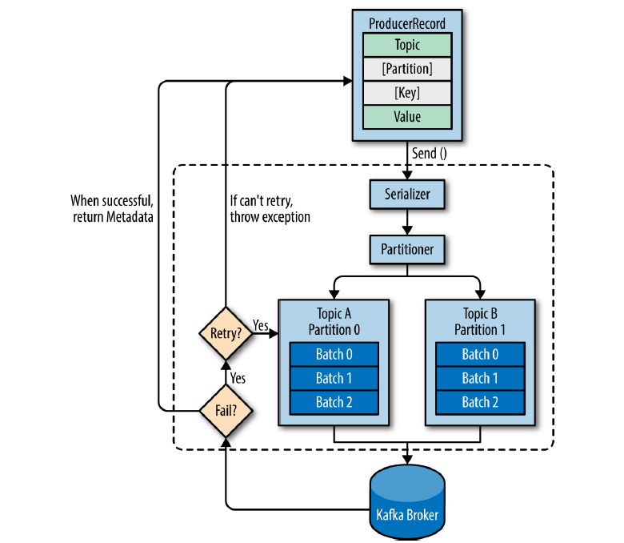

# 3장 카프카 기본 개념과 구조
---
용어정리 
- 주키퍼: 아파치 프로젝트 애플리케이션 이름입니다. 헬스체크와 메타데이터 관리 담당.
- 카프카: 아파치 프로젝트 애플리케이션 이름. 여러대의 브로커를 구성한 클러스터를 의미.
- 브로커: 카프카 애플리케이션이 설치된 서버 또는 노드를 말함.
- 프로듀서: 카프카로 메시지를 보내는 역할을 하는 클라이언트를 말함.
- 컨슈머: 카프카에서 메시지를 꺼내가는 역할을 하는 클라이언트를 말함.
- 토픽: 메시지 피드를 토픽으로 구분하며 이들의 이름은 고유함.
- 파티션: 병렬처리 및 고성능을 얻기 위해 하나의 토픽을 여러개로 나눈것. 
- 세그먼트: 전송한 실제 메시지가 브로커의 로컬 디스크에 저장되는 파일을 의미. 
- 메시지 또는 레코드: 프로듀서가 브로커로 전송하거나 컨슈머가 읽어가는 데이터 조각을 말함.

## 리플리케이션 

```
/usr/local/kafka/bin/kafka-topics.sh --bootstrap-server peter-kafka01.foo.bar:9092 --create --topic peter-overview01 --partitions 1 --replication-factor 3
// 카프카 내에 3개의 리플리케이션을 유지하겠다는 의미. 
```
각 메시지들을 여러개로 복제해서 카프카 클러스터 내 브로커들에게 분산시키는 동작을 의미합니다. 즉 레플리케이션의 팩터수가 3이라는 것은 토픽의 파티션(메시지 저장공간)들이 3개의 브로커에 복재되어있다는 것을 의미합니다. 

## 파티션
하나의 토픽이 한번에 처리할 수 있는 한계를 높이기 위해 토픽 하나를 여러개로 나눠 병렬처리가 가능하게 한 것을 파티션이라고 합니다. 이렇게 나뉜 파티션 수만큼 컨슈머를 연결할 수 있습니다. 

파티션은 늘리기는 가능하나 줄이는건 불가능합니다. 

## 세그먼트

프로듀서에서 컨슈머로 메시지를 보내면 저장되는 곳은 토픽의 파티션입니다. 
```
cd /data/kafka-logs/
ls
```
을 입력하면 그중 {토픽의이름}-{파티션디렉토리번호}라는 이름의 디렉토리가 존재합니다. 그 디렉토리에는 log파일이 존재하는데 이것이 세그먼트로 브로커의 로컬디스크에 저장됩니다. 

---
## 카프카의 핵심 개념
카프카는 높은 처리량과 빠른 응답 속도, 안정성을 갖습니다. 아래와 같은 요인들 때문에 가졌다고 합니다.
#### 분산 시스템
분산시스템답게 확장성과 장애 대응등 장점을 갖을수 있었습니다.
#### 페이지 캐시
OS의 캐싱기능을 사용하여 디스크에서 읽고쓰기를 하지 않고 캐시를 통해 읽고 쓰기가 발생합니다. IO을 줄일수 있어서 높은 처리량을 얻을수 있습니다. 
#### 배치 전송 처리
배치 전송을 통해 네트워크 오버헤드를 줄이고 더욱 바르고 효율적으로 처리합니다. (실시간성은 조금 줄어들수 있을거 같습니다.)
#### 압축 전송
높은 압축 전송을 권장합니다. 압축을 통해 네트워크 대역폭이나 회선 비용을 줄일수 있습니다. 
#### 토픽,파티션,오프셋
토픽이라는 곳에 데이터를 저장합니다.(메일 전송시의 이메일 주소라고 생각하면 쉽다고 합니다.)
이는 병렬 처리를 위해 파티션이라는 단위로 다시 나뉩니다. 이 파티션의 메시지가 저장되는 위치를 오프셋이라고 부르며 오프셋은 순차적으로 증가하는 숫자 형태로 되어 있습니다. 이를 통해 메시지의 순서를 보장하고 마지막까지 읽은 위치를 알 수도 있습니다.
#### 고가용성 보장
고가용성 보장을 위해 리플리케이션 기능을 사용합니다. 토픽의 파티션들을 복제하여 가용성을 높입니다. 

#### 주키퍼의 의존성
주키퍼는 여러대의 서버를 앙상블(클러스터)로 구성하고, 살아 있는 노드 수가 과반수 이상 유지된다면 지속적인 서비스가 가능한 구조입니다. 따라서 주키퍼는 반드시 홀수로 구성되어야 합니다. 
znode를 이용해 카프카의 메타 정보가 주키퍼에 기록되며, 주키퍼는 이러한 지노드를 이용해 브로커의 노드 관리, 토픽 관리, 컨트롤러 관리 등 중요한 역할을 합니다. 

### 프로듀서 디자인


ProducerRecord는 전송하기 위한 실제 데이터로, 토픽, 파티션, 키, 밸류로 구성됩니다. (파티션과 키는  선택사항입니다.)
다음으로 send()함수를 통해 직렬화와 파티셔너를 거치게 되고 만약 레코드의 파티션이 지정되어있다면 파티셔너는 아무런 동작을 하지않습니다. 파티션을 지정하지 않았다면 키를 가지고 파티션을 선택해 레코드를 전달합니다. 일반적으로 라운드로빈을 사용합니다. 

프로듀서의 전송 방법은 크게 3가지입니다.
- 메시지를 보내고 확인안하기.(ACK을 안받는 다는 의미인듯.) 
- 동기(메시지 보내고 ACK 기다리기)
- 비동기(메시지 보내고 ACK 안기다리고 자기 할일하기. 근데 ACK을 받긴함.)


